# Portals Grey Hat

I'm convinced the only limitation of the different Portals passes is the quantity of simultaneous visitors. If you're a new builder and don't expect high traffic, you can create complex and engaging worlds using the portals/spawn points functions in your Genesis pods.  
I'll demonstrate how you can use `B` to navigate outside the walls of your pod and import GLB files of larger rooms, or even worlds to spawn into.. with no loading screen!  
##
When you purchase a TNEC nft from any secondary marketplace, you are given this Genesis pod to build in. Most of the available items in the inventory are too large to fit in the available floorspace. Why is that, you may wonder? <i>There is a larger world out there!</i>  
When you enter your Genesis pod Portal it will look like this.
  
Press the `B` key and then hold down the space bar for a few seconds. You'll pop out of the pod and see this view.
  
Go to [Sketchfab](https://sketchfab.com/) and search for free downloadable rooms or environments.
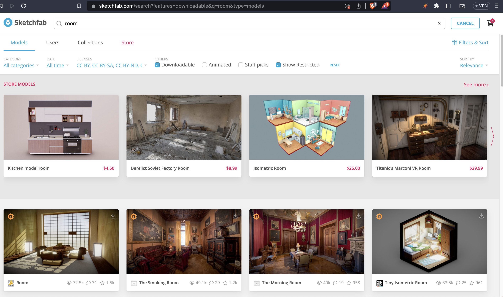  
Download the Converted Format GLB (the very bottom download selection).
  
Head over to [glitch](https://glitch.com/), create an account, and create a New Project. Select the first, hello website.
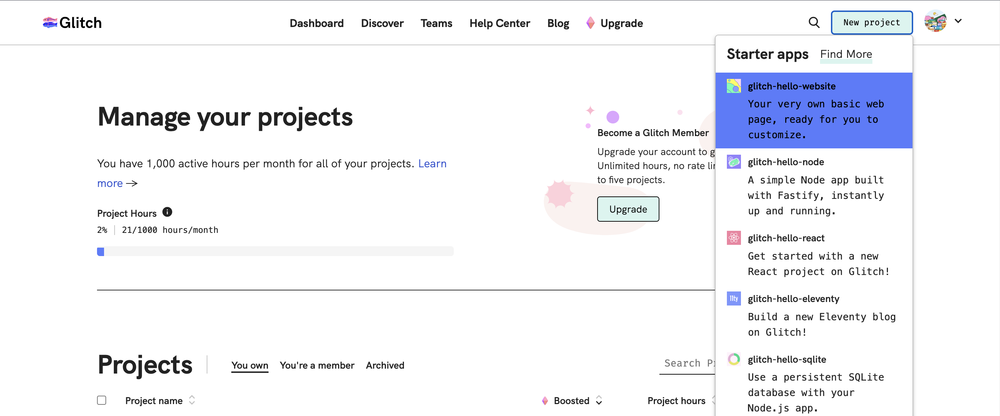  
Upload your GLB into your Assets folder.
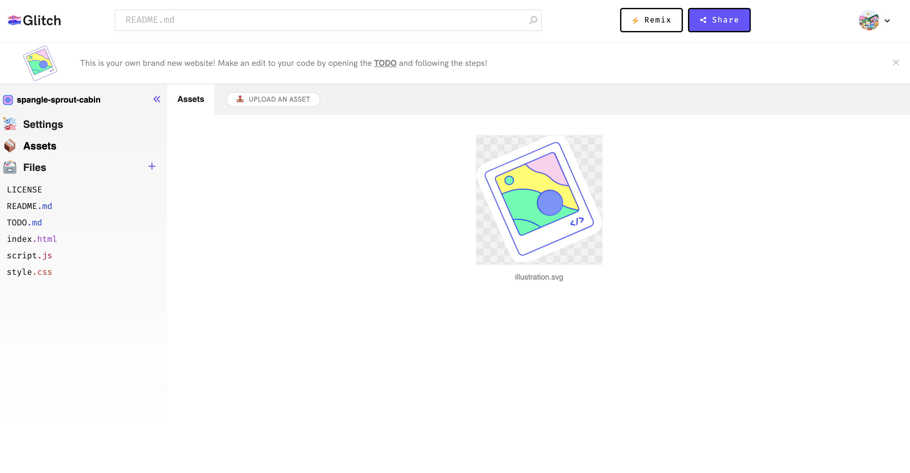  
Copy the URL.
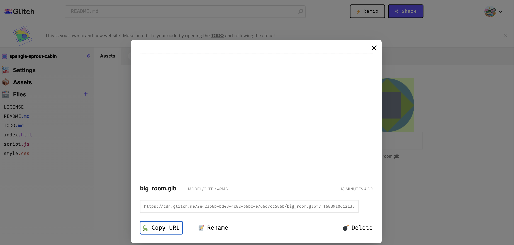  
Activate edit mode, select Custom Import, and paste your GLB URL. For this example, I'm using [this model](https://sketchfab.com/3d-models/rooftop-garden-with-loft-47f4fa5c8c7a4f5a8c49490179b2e52f)
  
It will look like this while it loads.
  
Then you'll be able to place your model, but only in certain places. Don't worry, you'll be able to modify the size and location, just click anywhere the GLB doesn't appear red. Right click the imported GLB to adjust the size, toggle shadow and collider. <i>(Disabling the collider turns the object into a ghost visitors to the space can pass, or fall, straight through.)</i>
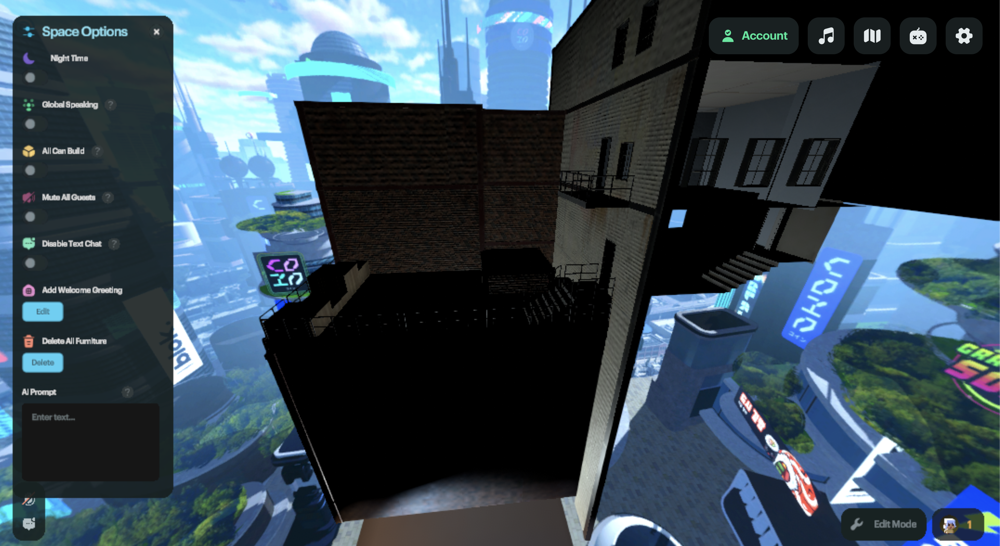  
Objects outside the genesis pod will need Light Sources whether day or night, so I prefer to swap to night theme. Totally up to you. Add a few Light Sources either way and begin exploring the object from your free-floating camera view.
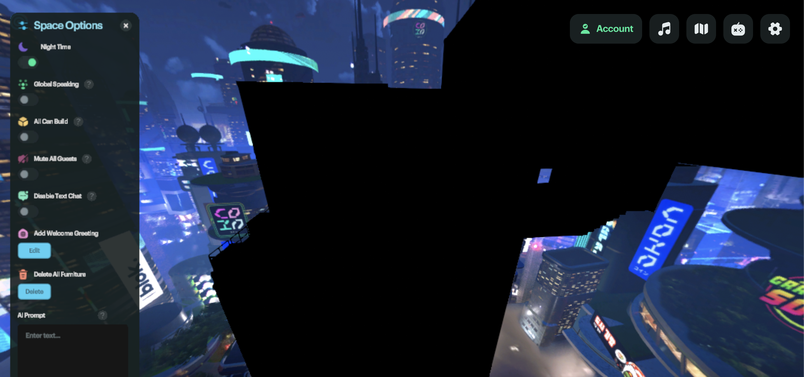  
Find a good location on your new object to place a Spawn Point from the Editor menu. Right click the Spawn Point, disable Default Spawnpoint, and give it a unique name. 
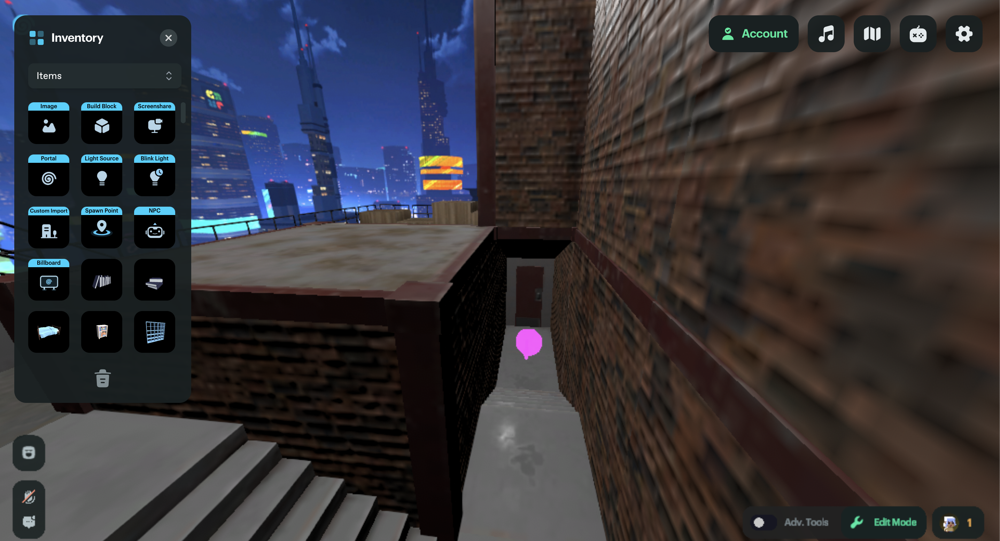  
Add a Portal from the Editor menu as well. You can add a message, or toggle auto-teleport, by right clicking the Portal.
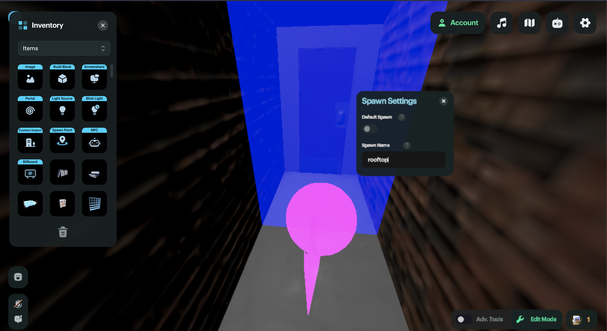  
This part is optional, but you can connect an imported GLB to your new environment via the Click Interactivity tool. For this example, I'm just importing a door to represent the roof access.
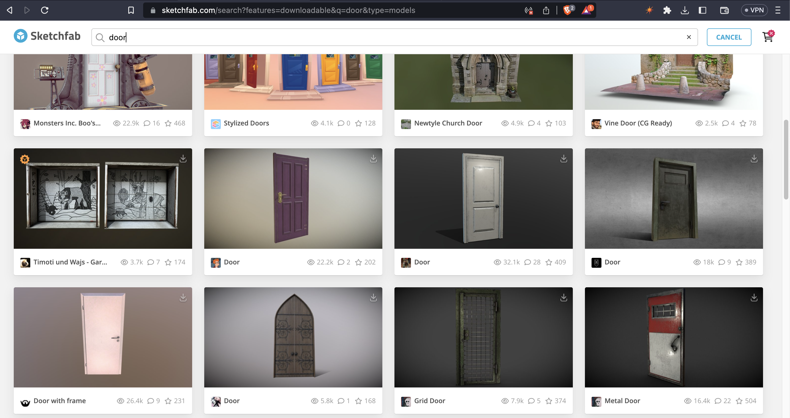  
Right click the door and select GLB Settings.
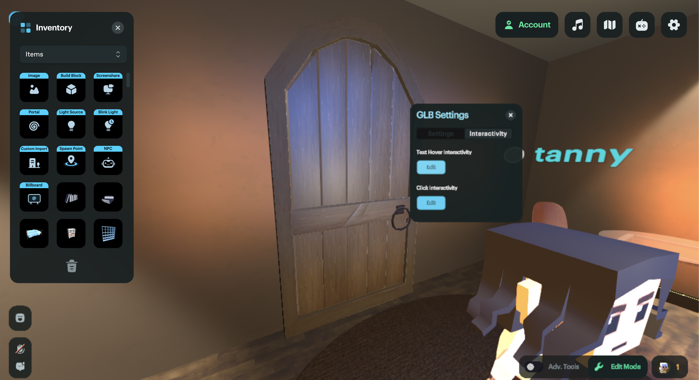  
Copy the Spawn Link from the Spawn Point you added to your new location and press `B` to return to your pod. Select the Hover Interactivty to label your door, and the Click Interactivity to paste the Spawn Link.
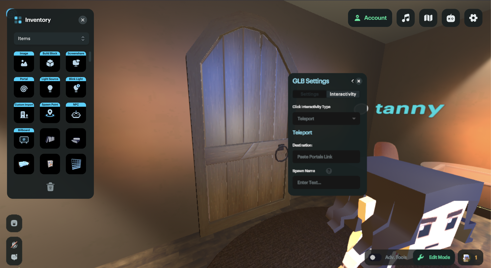  
Disable editor mode and click the door to check out your new space! You can view this space [here](https://theportal.to/?room=060c72d7-f535-4544-bd65-af5dda5108dd)
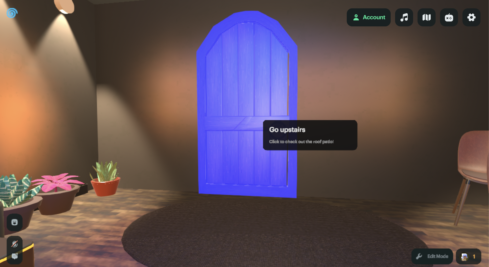  
Now you can explore this new environment and return to your Genesis pod. This can be repeated with many multiple environments.
  
For example, if you'd just like a larger, empty room, you can set the default Spawn Point in such an environment.
  
Or create multiple portals from the Genesis pod to other imported locations.
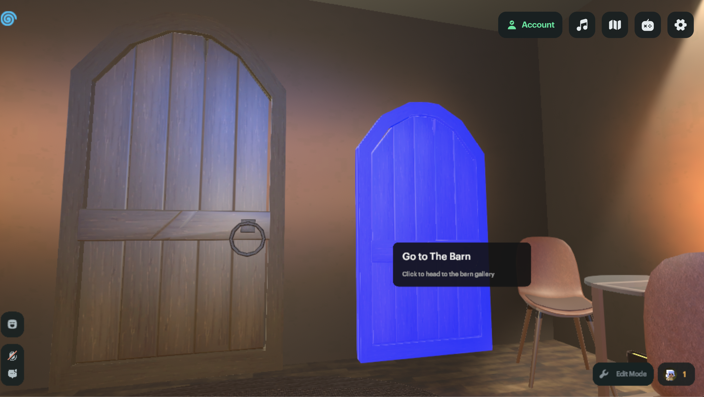  
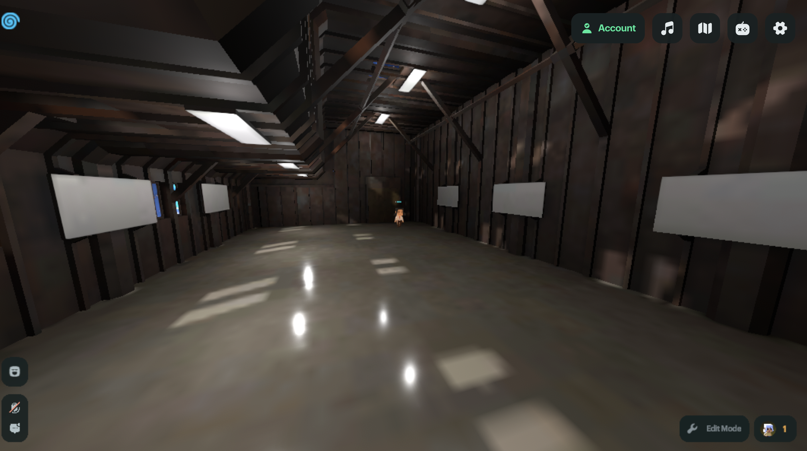  
Repeating the Portal/SpawnPoint process as needed.
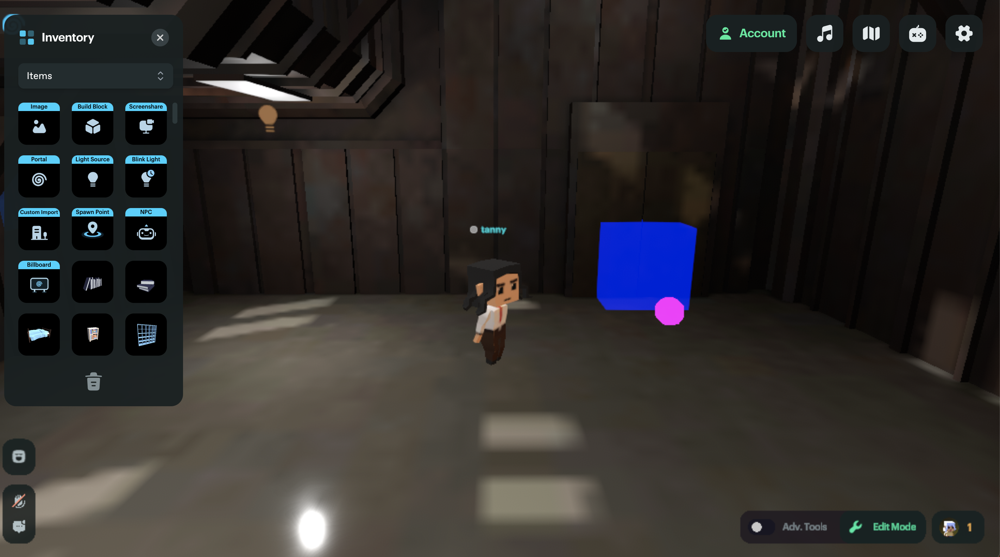  
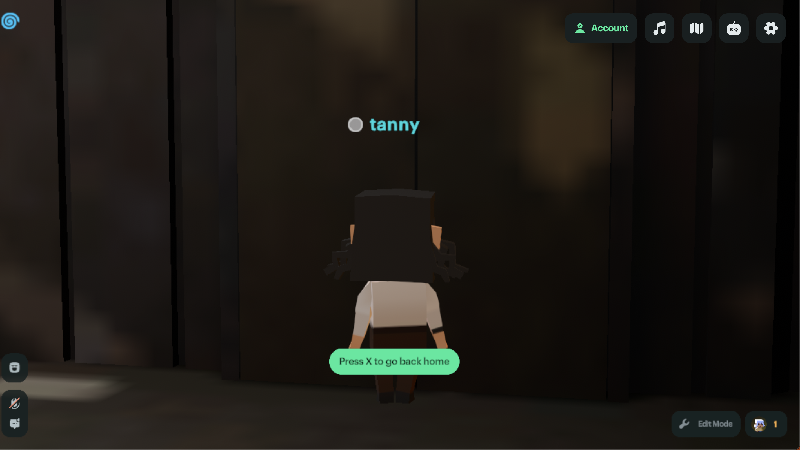  
To push the limits of the Genesis pod, I imported a large showroom floorspace and filled it with GLBs. A Lambo, a Bronco, and dozens of stages, booths, and more.
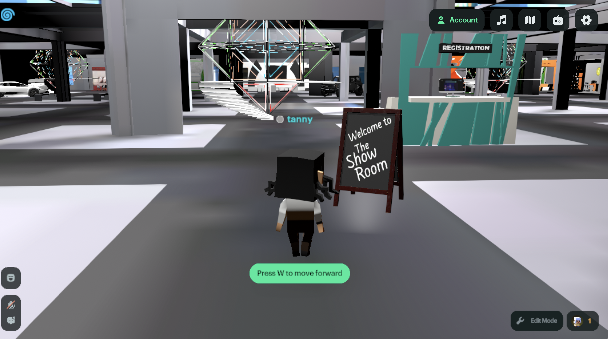  
It's really, really big. You can view this portal. [here](https://theportal.to/?room=7d35e440-1f3d-4af4-89ec-87b461aa7fdc)
  
So naturally, I began duplicating the entire showroom.
  
I duplicated the space 24 times, which continued to run smoothly on a 1.4gzh MacBook Pro with just 8gb RAM. I clearly could have continued to do so, seemingly without end.
  
From a builder's perspective, there's no easier way to begin building in the metaverse than right in your browser window. Big up Portals crew for all your support. I hope this walkthrough helps new builders in the space! 
  
## Portals Assets

There are some limitations on the size objects you import. Try to shoot for objects less than 10MB, ideally around 1mb or smaller. I've begun to compile some of the GLB's that I've enjoyed working with in Portals. You can check it out [here](https://sketchfab.com/denverhnt/collections/portals-assets-4a4599d245f64d6bb0ea6ccdce0400bd).
  
If you like what I did here, you can buy me a coffee by donating SPL tokens to `tanny.sol` 
