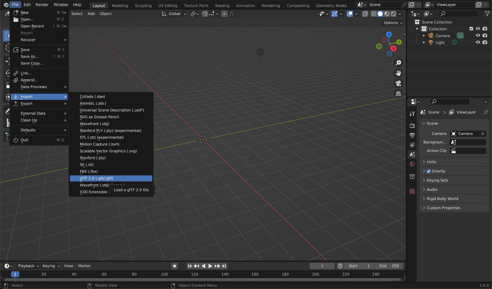

# TNEC Animations in Portals

You can add `&glbavatar2022=true` to the end of any Portals address and import your own GLBs, but there's a few tricks to make this as easy as possible.<br><br>
You can easily copy the command here:
```
&glbavatar2022=true
```
If you've been given a GLB of your TNEC avatar, you can import it directly in the Portals loading screen and it will work perfectly.<br><br><i>[Dont have one?](https://github.com/ilovespectra/portals/edit/main/avatars/README.md#want-a-tnec-avatar)</i><br><br> If you'd like to import your character as a GLB or NPC, that may take a little extra work. I'll show you how to make it happen. 

## Download Blender

[Download Blender](https://www.blender.org/download/), a free modeling application. It's very complex, has many layers, and a dramatic learning curve. We're going to take a few shortcuts to get you to the top of the class.

### Import your GLB to Blender

Right click and Delete the default object.

<br><br>

Import your GLB.

<br><br>

Export as FBX.

<br><br>

## Create a Mixamo Account

[Head over to Mixamo](https://www.mixamo.com/) and create an account. This Adobe webpage will animate your avatar to give it live idle animations.

## Import your GLB to Mixamo

In order to do so, you'll need to convert the file to an FBX, OBJ, or ZIP. You can convert your GLB to these formats using [this converter](https://imagetostl.com/convert/file/glb/to/fbx), which works [the other way](https://imagetostl.com/convert/file/fbx/to/glb) just as easily. Your other option is to import the GLB in Blender, then export as your desired format. 
You can get a GLB from [Sketchfab](https://sketchfab.com/) but you can typically also download the other formats directly. 

Setup your Auto Rigger.

<br><br>

## Select an Animation

Choose an animation that you like, preferably a short one that loops well for better loading. 

Select an animation, and download the FBX binary.

<br><br>

## Reload you animation back into Blender

You'll need to reskin your avatar. You can do so by copy pasting all the contents from the GLB file. Simply import them beside one another and drag and drop.<br><br>
Allow me to elaborate...<br><br>
Import your FBX file into Blender that you just downloaded from Mixamo. You'll notice it is grey, and in need of some love. Go ahead and import that GLB you used to create your original FBX, it's ok they're laying right on top of one another.<br><br>
Click the Shading tab, select the Viewport Shading Tab <i>below `Scene` and above `Options`</i>, and click the Surface of your avatar. Copy all of the contents except the Material Output box.
<br><br>
Click the same Surface, or skin, on your grey imported animated avatar and paste in the window below.
<br><br>
Right click in the background space behind these boxes and select Cut Links.
<br><br>
Cut only the link between the previous Principled BSDF and Material Output.
<br><br>
Click and drag to establish a link between the pasted Node Context modules and Material Output, from BSDF to Surface.<br><br>
You'll need to repeat this process for each section of your avatar, including the face, chest screen, and antennas, being careful to include any wearable objects that make your avatar unique. You can drag one model out of the way of the other to make it easier to select. Then delete all the elements of the GLB, otherwise it'll look a little funny.
<br><br>
Click the Animation tab to bring your avatar to life!
<br><br>

## Export as GLB

Simply export as GLB, add to your Glitch, and import to your Portals space to see it go brrr! This is useful for creating in-game versions of yourself for your visitors to interact with, a bit nicer than the t-pose!

## Demo

Screenshots of all of this to come, gtg to work rn but wanted to share this because I'm excited about it. 

[View the demo of my avatar busting a move here](https://youtu.be/f-xM49QmDxM)
<br><br>
You can visit this space for the time being to see it IRL. [Check it out](https://theportal.to/?room=68b33f7c-dded-49e5-bee9-8cfcb6a9adf1)

### Want a TNEC avatar?

[Here you go!](https://github.com/ilovespectra/portals/blob/main/avatars/assets/TNEC-lightgrey-portals.glb)

This is just a simple grey TNEC with the Portals logo on the chest screen


